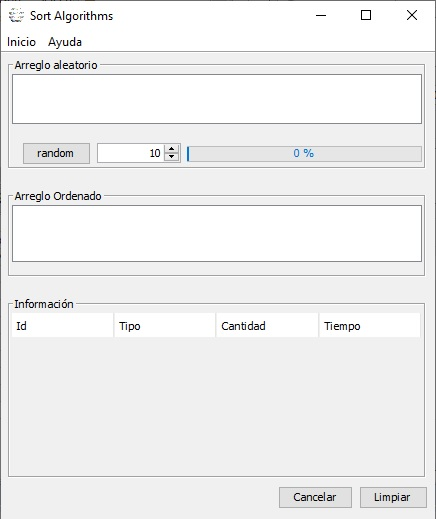

# Sort Methods
---
Aplicación que compara los tiempos de respuesta al ordenar arreglos numericos aleatorios de distinto tamaño
implementando distintas formas de ordenacion.

[Descargar programa](http://www.mediafire.com/file/kp3lm5713pusvn6/Sort.exe/file)